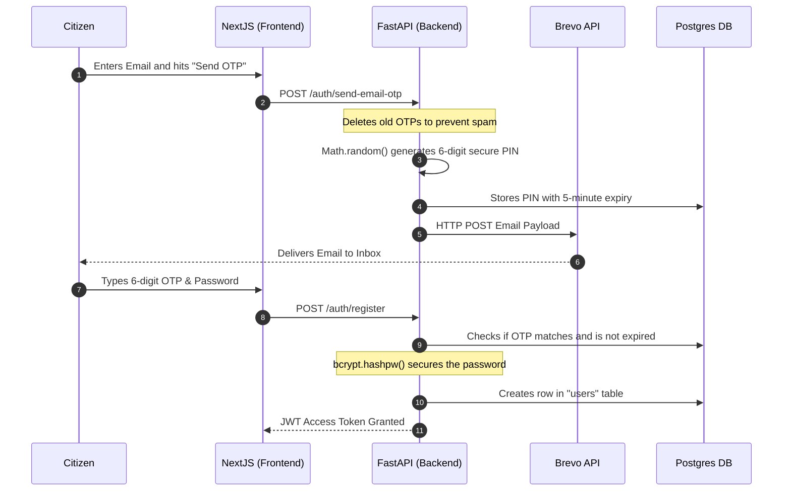
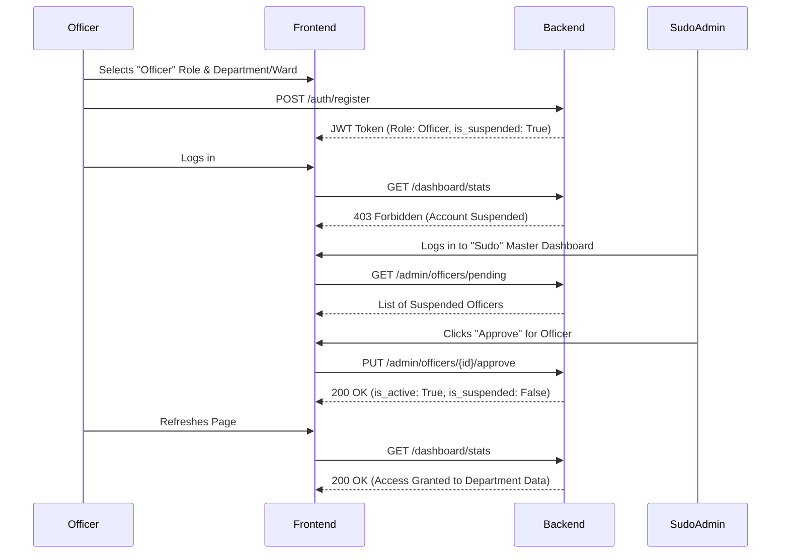
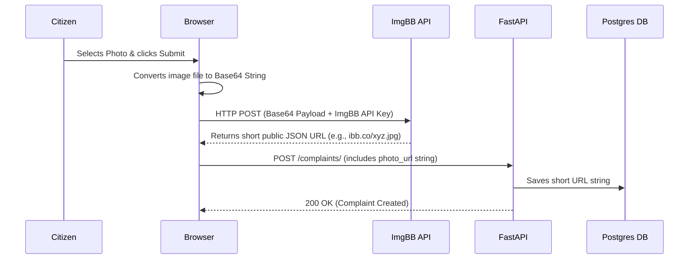
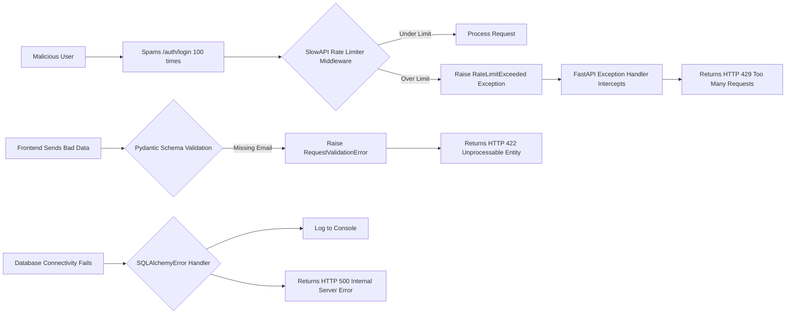

# CityShakti: Comprehensive System & Codebase Documentation

This document serves as the absolute, definitive guide to the **CityShakti** Smart Civic Monitoring System. It leaves nothing out. It covers every platform, every third-party API, the complete system architecture, flowcharts for every situation, and a line-by-line / file-by-file explanation of both the Backend and Frontend codebases.

---

## 1. Hosting Platforms & Infrastructure
CityShakti operates on a decoupled architecture, separating the client-side rendering from the server-side API processing.

*   **Frontend Hosting (Vercel):** The React/Next.js client is hosted on Vercel. Vercel provides Edge network caching, ensuring that the HTML/CSS and static assets load instantly for citizens across the region.
*   **Backend Hosting (Render.com):** The FastAPI Python backend is hosted on Render. Render continuously spins the Python environment, running `uvicorn` to listen for API requests.
*   **Database (PostgreSQL):** A managed relational PostgreSQL database stores all structured state (Users, Complaints, OTPs, Audit Logs).

## 2. Third-Party APIs & Services
The platform offloads specific complex workloads to specialized third-party APIs:
*   **Ola Maps API:** The primary engine for high-precision regional intelligence. Replaced the legacy OpenStreetMap (Nominatim) implementation to achieve 100% accuracy for 6-digit Indian PIN codes.
    *   **Reverse Geocoding:** Converts GPS coordinates into strict `incident_ward` values using `api.olamaps.io/places/v1/reverse-geocode`.
    *   **Vector Tiles:** Provides the interactive map layer for the dashboard via MapLibre GL JS, authenticated via dynamic `transformRequest` headers and the `NEXT_PUBLIC_OLA_MAPS_API_KEY`.
*   **Brevo (formerly Sendinblue) SMTP API:** Used exclusively for Identity Verification. When a user registers or logs in, the backend securely communicates with `api.brevo.com` using the `BREVO_API_KEY` to dispatch 6-digit One-Time Passcodes (OTPs) to the user's email account. 
*   **ImgBB API:** Used for Evidence Storage. Because hosting base64 images inside a PostgreSQL database is highly inefficient, the frontend intercepts image uploads from the citizen's phone/camera, sends the raw file to `api.imgbb.com`, receives a public `photo_url`, and only saves that short URL string to our database.
*   **HTML5 Geolocation API:** The frontend heavily relies on native browser GPS sensors to extract `latitude` and `longitude` during complaint submission, enabling Ola Maps PIN code mapping.

---

## 3. Core System Workflows (How Things Work)

### A. The Registration & Authentication Pipeline
This workflow ensures that users are real, and that Government Officers are verified before getting access to the system.



### B. The Complaint Routing & Lifecycle Workflow
This flowchart illustrates what happens from the moment a pothole is reported to the moment it is fixed.

```mermaid
stateDiagram-v2
    [*] --> Submitted : Citizen clicks "Submit Complaint"
    
    state Submitted {
        direction LR
        Geo[Extract GPS] --> Ola[Ola Maps Reverse Geocode]
        Ola --> Map[Extract 6-Digit PIN]
        Map --> ML[AI Predicts Deadline]
        ML --> DB[Save to Database]
    }
    
    Submitted --> Pending : Routed to Officer Dashboard (matching Dept & PIN)
    
    Pending --> InProgress : Officer clicks "Mark In-Progress"
    InProgress --> Resolved : Officer clicks "Mark Resolved"
    
    Resolved --> Closed : Citizen Verifies & Approves the Fix
    Resolved --> Escalated : Citizen Rejects the Fix (Penalizes Officer)
    
    Pending --> Escalated : System Clock breaches SLA Deadline
    InProgress --> Escalated : System Clock breaches SLA Deadline
    
    Closed --> [*]
```
**Explanation of Edge Cases:**
- **Citizen Rejection:** If an officer marks an issue "Resolved" but the pothole is still there, the citizen presses `Reject Resolution`. The status becomes `Escalated`, and the department's metrics are penalized.
- **SLA Breach:** Run by an automated background check, if the system clock passes the `expected_resolution_date` and the status is still Pending/InProgress, the complaint turns `Escalated`.

### C. The Government Officer Approval Pipeline
To ensure security, public officials cannot immediately access internal dashboards upon registration. They are isolated until a top-level administrator verifies their credentials.



### D. The Dynamic SLA & Progress Update Flow
How the backend calculates deadlines, and how officers communicate updates to the public with images before resolving a ticket.

```mermaid
flowchart TD
    A[Citizen Submits Issue] --> B{AI SLA Router}
    B -->|Urgent: Water Pipe| C[SLA = 24 Hours]
    B -->|Medium: Pothole| D[SLA = 3 Days]
    B -->|Low: Park Cleanup| E[SLA = 7 Days]
    
    C --> F[Officer Dashboard]
    D --> F
    E --> F
    
    F --> G[Officer Begins Work]
    G --> H[Uploads Before Photo Update]
    H --> I[Uploads After Photo Update]
    I --> J[Officer Marks Resolved]
    Note right of J: UI LOCK: Buttons disabled to prevent duplicate updates
    J --> K[Wait for Citizen Verification]
    K --> L{Citizen Response}
    L -->|Accept| M[Status: Closed]
    L -->|Reject| N[Status: In-Progress (Buttons Re-enabled)]
```

### E. Public Transparency & Community Engagement Flow
Citizens don't need to create redundant complaints. The system offers a community feed to consolidate voices.

```mermaid
flowchart LR
    A[New Pothole Complaint] --> B[Appears on Regional Map as Red Dot]
    B --> C[Citizen Views Map]
    C --> D{Is it in my Ward?}
    D -->|Yes| E[Visible Pin with "Support" Button]
    D -->|No| F[Filtered Out (Citizen Lock)]
    E --> G[Clicks "Support in Community"]
    G --> H[Deep Link Redirection to Community Tab]
    H --> I[Auto-Opens Complaint Detail Modal]
    I --> J[Clicks Upvote]
    J --> K[Backend Increments Priority Score]
    K --> L[Pushes Issue to Top of Officer's Dashboard]
```

### F. Evidence Image Upload Sequence (ImgBB)
To keep the PostgreSQL database blazing fast, large binary image files are never stored in the database. 



### G. Data Aggregation & Admin Analytics Pipeline
How the "Sudo" and "Officer" dashboards render real-time statistics without crashing the database under heavy load.

```mermaid
flowchart TD
    A[Frontend Dashboard Mounts] --> B[GET /dashboard/stats]
    B --> C{FastAPI Dependency Check}
    C -->|Unauthorized| D[Return 401/403]
    C -->|Authorized| E[SQLAlchemy Aggregation]
    
    E --> F["db.query(func.count(Complaint.id)).group_by(status)"]
    F --> G[JSON Payload Generated]
    G --> H[Frontend Recharts Library]
    H --> I[SVG Bar/Pie Charts Rendered]

### I. Elastic Bounding Box Logic (Spatial Restraint)
To prevent Citizens and Officers from wandering across the entire map of India, the system calculates a dynamic boundary based on the complaints within their jurisdiction.

```mermaid
graph TD
    A[Load Complaints for Ward] --> B[Generate LngLatBounds Object]
    B --> C[Calculate latDiff & lngDiff]
    C --> D[Apply 50% Elastic Buffer]
    D --> E[map.setMaxBounds(elasticBounds)]
    E --> F[Restrict User to Ward View]
```
**Technical Implementation:**
- **Buffer**: A 50% padding is added to the SW and NE coordinates of the ward's complaints.
- **Fallthrough**: If no complaints exist, the map defaults to the center of Delhi with a broad view until reports are filed.
- **Safety**: Prevents information leakage from other wards to unauthorized users.
```

### H. Global Error Handling & Rate Limiting Architecture
The system is protected globally by middleware and exception handlers to ensure elegant failures and prevent DDoS attacks.



---

## 4. Frontend Codebase: File-by-File Explanation
The entire user interface is built using Next.js 13+ (App Router), React, Tailwind CSS, and Shadcn UI components.

### Core Configuration
*   **`frontend/package.json`**: Lists all npm dependencies (`maplibre-gl` for maps, `lucide-react` for icons, `date-fns` for time, `recharts` for charts).
*   **`frontend/.env.local`**: Stores critical integration keys:
    *   `NEXT_PUBLIC_OLA_MAPS_API_KEY`: Authenticates Tile & Geocoding requests.
    *   `NEXT_PUBLIC_API_BASE_URL`: Defines the Backend endpoint (Cloud or Localhost).
*   **`frontend/tailwind.config.js`**: Controls the professional design system, including custom color tokens (`chart-1` through `chart-5`).

### The App Router (`/app`)
*   **`frontend/app/layout.tsx`**: The main HTML wrapper. It contains the `<head>` tags, imports the global CSS, and wraps the entire application in the `ThemeProvider` (for dark mode) and `AppProvider` (for global React state).
*   **`frontend/app/page.tsx`**: The main route (`/`). It dictates the view hierarchy. If the user is *not* logged in, it shows the landing page. If they *are* logged in, it mounts the `<DashboardLayout>` component.

### The React Context & Logic (`/lib`)
*   **`frontend/lib/app-context.tsx`**: A massive React `createContext` wrapper. It holds global state (`user`, `complaints`, `theme`). It exposes a custom hook `useApp()`. This ensures we don't have to pass "user={user}" down a 20-component deep prop-chain.
*   **`frontend/lib/api.ts`**: The bridge to the backend. It contains dozens of `fetch()` functions (`loginApi`, `registerApi`, `getComplaintDetailApi`). It reads the `NEXT_PUBLIC_API_URL` environment variable (pointing to Render in production) and transforms the JSON responses into strictly typed TypeScript objects.
*   **`frontend/lib/data.ts`**: Contains all the TypeScript interfaces (`type Complaint`, `type User`). Defines exactly what properties exist on a complaint object (e.g., `expectedResolutionDate`, `photoUrl`).
*   **`frontend/lib/utils.ts`**: Contains the `cn()` helper function which merges Tailwind classes dynamically using `clsx` and `tailwind-merge` (preventing CSS conflicts).

### The UI Components (`/components`)
*   **`frontend/components/dashboard-layout.tsx`**: The structural shell of the logged-in app. It renders the top navigation bar, the sidebar menu, the user profile dropdown, and the "Log Out" button.
*   **`frontend/components/login-page.tsx` & `register-page.tsx`**: The authentication forms. They handle user input, form validation, toggling loading spinners, executing the OTP email request, and finally catching the JWT token to log the user in.
*   **`frontend/components/map-view.tsx`**: The interactive visual command center.
    *   **Engine**: Built on MapLibre GL JS with Ola Maps Vector Tiles.
    *   **Elastic Bounding Box**: Automatically restricts Citizens and Officers to their own ward with a dynamic 50% buffer, preventing "map wandering" while ensuring all local issues are visible.
    *   **Deep Linking**: Features a "Support in Community" button that uses global React context to redirect users to the Community tab and auto-open the complaint for upvoting.
    *   **Strict Filtering**: Citizens are strictly limited to seeing "red dots" only from their own registered PIN code region.
*   **`frontend/components/community-view.tsx`**: A public feed that fetches all complaints in the current PIN code. It implements an auto-open listener for deep-linked complaints from the Map.
*   **`frontend/components/dashboard-overview.tsx`**: The primary operational dashboard.
    *   **Logic:** Dynamically renders UI based on `user.role` (Citizen/Officer/Sudo).
    *   **Redundancy Fix**: Implemented `isActionPending` state logic. When an officer clicks "Mark Resolved", all action buttons enter a `disabled` state and text changes to "Processing..." until the API response returns and the local state is synchronized.
    *   **Administrator Controls**: Features a "Dept/Ward Match" security check. An officer can *view* any public report, but can only *modify* (Update/Resolve) a report if their `user.department` matches the complaint's department AND their `user.ward` matches the incident location.
    *   **Visual Feedback**: Integrated `uploadingUpdateImage` spinner and custom `Badge` colors for "Escalated" status (pulsing red).
    *   **Role Badges**: Logic fixed to correctly display "Officer Access" badges in the global header, ensuring clear session visibility.
*   **`frontend/components/officer-management.tsx`**: A Sudo-Admin strictly protected view. Renders a table of pending Government Officer accounts. Sudo admins click "Approve" (which flips `is_active=True` in the DB) or "Suspend".
*   **`frontend/components/ui/*`**: A folder containing 40+ atomic, reusable UI components (Buttons, Inputs, Dialogs, Badges, Tabs, Skeleton loaders). These are generated by Shadcn UI and ensure the application always looks professional and accessible (WAI-ARIA compliant).

---

## 5. Backend Codebase: File-by-File Explanation
The whole API is built on FastAPI (modern Python 3.10+ ASGI framework) aiming for extreme performance and absolute Type Safety.

### Core Configuration & Boot 
*   **`BackEnd/main.py`**: The heart of the backend.
    *   **CORS Protection:** Configures `CORSMiddleware` to ensure only the Vercel frontend URL is permitted to make requests (blocking cross-site scripting from attackers).
    *   **Rate Limiting:** Injects `slowapi` to block IP addresses making too many requests per minute.
    *   **Auto-Migration:** Uses an `@app.on_event("startup")` hook to run `subprocess.run(["alembic", "upgrade", "head"])`. This means when Render boots the server, it automatically creates the SQL tables if they don't exist.
    *   **Sudo Seeder:** Automatically creates the master `sudo@cityshakti.com` account on boot so developers never get locked out.
*   **`BackEnd/requirements.txt`**: Declares Python dependencies (FastAPI, Uvicorn, SQLAlchemy for the DB, Psycopg2-binary for Postgres drivers, Passlib for bcrypt hashing).
*   **`BackEnd/alembic.ini` & `alembic/`**: Configures the Alembic migration engine. The `alembic/versions` folder contains Python scripts that instruct Postgres exactly how to `CREATE TABLE`, `ADD COLUMN`, or `DROP TABLE` across different deployment versions without losing data.

### Database & ORM (`models`, `database`, `schemas`)
*   **`BackEnd/database.py`**: Initializes the SQLAlchemy `Engine` and `SessionLocal` class using the `DATABASE_URL` extracted from `os.getenv()`.
*   **`BackEnd/models.py`**: Translates Python Classes into Postgres Relational Tables.
    *   `User`: Holds `id`, `full_name`, `email`, `password_hash`, `role` ( citizen/officer/sudo ), `ward` (pincode), `department`. 
    *   `Complaint`: The massive ticket model. Holds `latitude`, `longitude`, `status`, `photo_url`, `is_sla_breached`. Uses `relationship("User")` to link a citizen's ID to the complaint.
    *   `EmailOTP`: Stores the 6-digit codes sent via Brevo, alongside an `expires_at` timestamp.
*   **`BackEnd/schemas.py`**: Pydantic validation models. While `models.py` defines the *database*, `schemas.py` defines *what the user is allowed to send over the API network*. (e.g., `UserRegister` schema ensures the password string is present. `ComplaintCreate` schema ensures lat/lng are floats).

### Security & Dependency Injection
*   **`BackEnd/security.py`**: Holds cryptographic math. 
    *   `hash_password(string)` transforms a plaintext password into an uncrackable Bcrypt hash.
    *   `verify_password(plain, hash)` compares a login attempt against the DB safely.
    *   `create_access_token(data)` signs a JSON Web Token using the `SECRET_KEY`.
*   **`BackEnd/dependencies.py`**: The gatekeeper. Contains injected functions like `get_db` (opens a fresh SQL transaction and safely closes it later). Contains `get_current_user` (reads the JWT header, decodes it, queries the DB, and throws `401 Unauthorized` if invalid). Contains `get_current_officer` and `get_current_sudo_user` to block roles that don't belong here.

### Services (The Business Logic)
*   **`BackEnd/services/notifications.py`**: Exclusively handles Brevo SMTP. Reads `BREVO_API_KEY` and `BREVO_SENDER_EMAIL`. Exposes a single `send_email_brevo(to, subject, html)` function.
*   **`BackEnd/services/ai.py`**: The predictive logic brain. Features the `predict_resolution_time(category, description)` function. It uses heuristic analysis (searching the text for keywords like "urgent", "major", "minor", checking the category) to calculate an SLA (Service Level Agreement) target. It adds X hours/days to the current `datetime.utcnow()` to generate the `expected_resolution_date`.

### Routers (The Network Endpoints)
*   **`BackEnd/routes/auth.py`**: Handles all Account routes. Contains `/register` (checks if user exists, creates them), `/login` (checks password, issues token), and `/send-email-otp` (fires Brevo code).
*   **`BackEnd/routes/complaints.py`**: The workhorse API.
    *   `POST /`: Takes a citizen's complaint form payload, triggers the AI in `services/ai` to assign a deadline, attaches the citizen's ID via the JWT dependency, and writes it to DB.
    *   `GET /`: Fetches lists of complaints. Dynamically filters the SQL query depending on if the requester is an Officer (only gets their PIN code) or Citizen (gets their own list). Include `.limit()` and `.offset()` for frontend pagination.
    *   `PUT /{id}/status`: Called by Officers to change the status (e.g., "Pending" -> "Resolved"). Logs an entry to `ComplaintActivity`.
*   **`BackEnd/routes/dashboard.py`**: Administrative endpoints. Runs complex SQL aggregation queries (`db.query(func.count(Complaint.id)).group_by(Complaint.status).all()`) to calculate the exact statistics rendered on the Next.js Recharts graphs.
*   **`BackEnd/routes/admin.py`**: Strict Sudo-only routes. Endpoints to `GET /officers/pending` or `PUT /officers/{id}/approve`.
*   **`BackEnd/routes/transparency.py`**: A public router that requires no JWT token. Allows anyone to fetch aggregated public stats for a specific PIN code, allowing communities to see their local government's resolution velocity without making an account.

---
**End of Documentation.**
*This system architecture correctly implements scalable modern computing principles, guaranteeing high performance under public load, stringent administrative boundaries, and zero-downtime scalability via Vercel/Render edges.*
